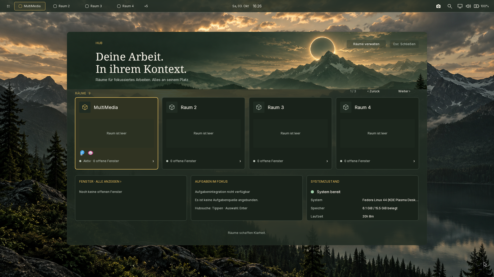
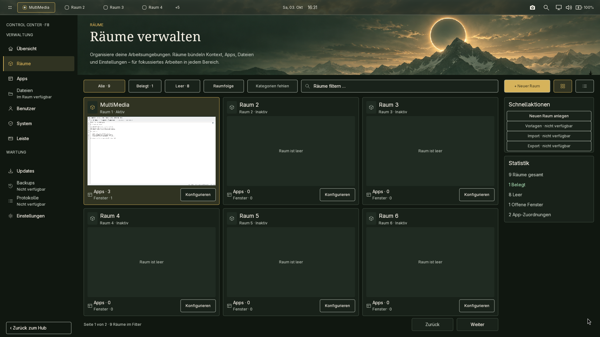
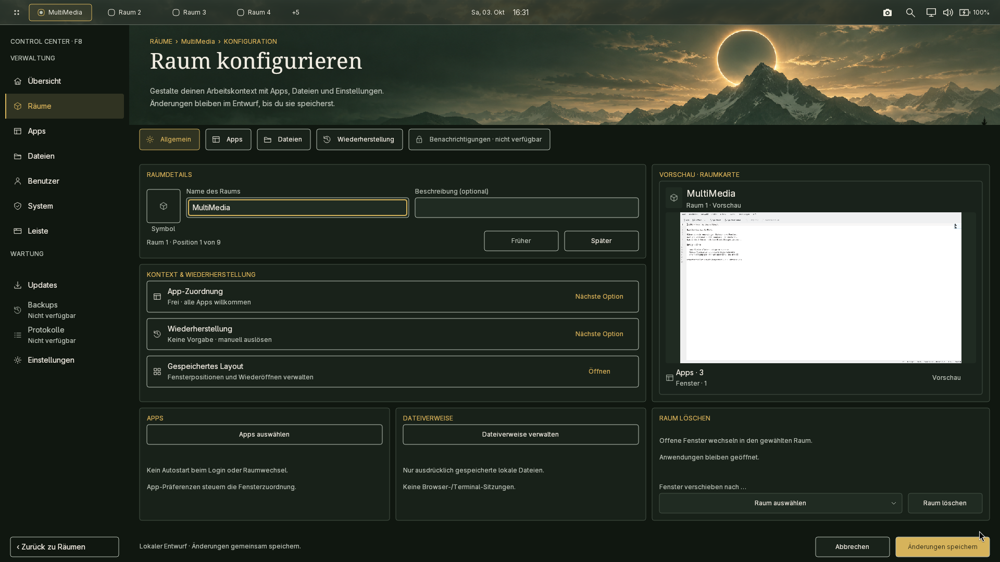
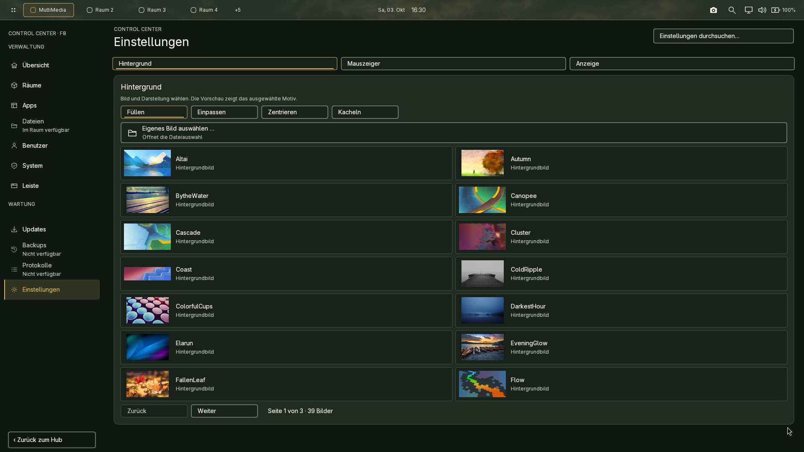
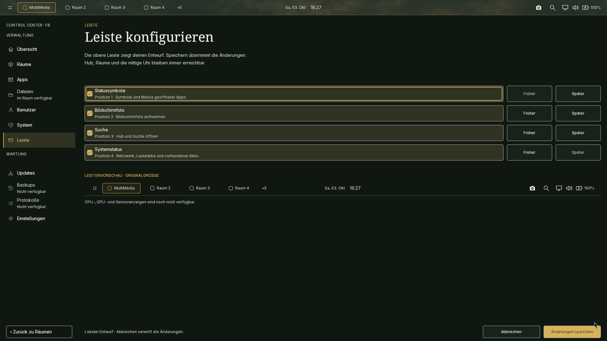

# NIWOE Desktop

**Deine Arbeit. In ihrem Kontext.**

NIWOE ist ein experimenteller nativer Linux-Desktop und Wayland-Compositor
in Rust. Räume bündeln Anwendungen, Fenster und Dateiverweise zu einem
Arbeitskontext. Ein gemeinsamer Hub verbindet Raumwahl, Suche und Überblick;
das Control Center führt Verwaltung und Einstellungen zusammen.

> **In Entwicklung — noch keine fertige Desktop-Alpha.** Die Aufnahmen zeigen
> den tatsächlich laufenden nativen Desktop auf Fedora vom **03.10.2026**.
> Funktionen, Integration und visuelle Qualität werden weiter überarbeitet.

**Geparkt seit 03.10.2026.** [Kurze Übergabe](HANDOVER.md),
[erfasste Testumgebung samt Grafiktreibern](docs/TEST_ENVIRONMENT_2026-10-03.md)
und [Codekarte/Guards](docs/CODE_GUIDE.md) halten den Wiedereinstieg fest.
Die erste ruhigere Designrunde ist abgenommen; R9 und die Gesamtfreigabe bleiben offen.
**Gaming/Vollbild unter Spielelast und Dauerbetrieb sind nicht freigegeben.**
Bekannt offen sind außerdem HiDPI-Schärfe, Kontrast über hellen Apps,
einzelne lange Hinweistexte und die Fedora-Updateintegration.

[](assets/screenshots/hub.png)

*Der Hub: Räume wählen, Anwendungen suchen und den aktuellen Kontext sehen.*

## Das Raumkonzept

Eine neue Sitzung beginnt in der neutralen **Loge**. Der Willkommens-Hub
führt in einen Raum; später ist er mit **Super+Space** erreichbar. Jeder Raum
kann eigene App-Zuordnungen, Dateiverweise und ein manuell wiederherstellbares
Fensterlayout erhalten. Die Loge bleibt der Einstieg und zählt nicht als Raum.

Das obere Panel hält Raumwechsel, Uhr und Systemzugang bereit. Im gemeinsamen
**Control Center** geht der Weg vom Überblick in die Raumdetails und zu den
Einstellungen. Dunkelgrüne Flächen, warme Akzente und eine gemeinsame native
Komponentenbasis verbinden diese Ansichten.

## Einblicke in den aktuellen Desktop

Die Raumvorschauen zeigen ein wirklich geöffnetes KWrite-Fenster mit einem
Beispieldokument. Alle Bilder sind unveränderte Screenshots der laufenden
Oberfläche. Ein Klick öffnet die jeweilige Aufnahme in voller Größe.

| Räume verwalten | Raum konfigurieren |
| --- | --- |
| [](assets/screenshots/rooms.png) | [](assets/screenshots/room-configuration.png) |
| Räume, Belegung und Fenster im Überblick. | Apps, Dateiverweise und Wiederherstellung im Kontext eines Raums. |

| Einstellungen im Control Center | Die Leiste gestalten |
| --- | --- |
| [](assets/screenshots/appearance.png) | [](assets/screenshots/panel-configuration.png) |
| Hintergrund, Mauszeiger und Anzeige im gemeinsamen Rahmen. | Module und Reihenfolge mit einer Vorschau in Originalgröße. |

Aufnahmedaten und Buildidentitäten: [Screenshot-Herkunft](assets/screenshots/README.md).
Die Galerie stammt vor der ruhigeren Designrunde vom selben Tag;
deren geprüfter Stand steht im [aktuellen Prüfbericht](docs/phase-reports/evidence/r9/calm-controls/README.md).

## Produktziel

Zuerst entsteht ein kohärenter Desktop auf einer bestehenden Linux-
Distribution. Ein eigenes Linux-basiertes NIWOE OS wird erst nach einer
brauchbaren Desktop-Alpha entschieden und geplant. NIWOE-Oberflächen bleiben
nativ in Rust; der archivierte WebKit-Prototyp ist ausschließlich eine visuelle
Referenz. Frühere NIWOE-/BSD-Strategien sind historische Evidenz.

## Architektur

- Der Smithay-basierte Compositor verantwortet Wayland/XWayland, DRM/KMS,
  Input, Fensterverwaltung, Fokus, Stacking und Policy.
- Die separate native Shell verantwortet Produktkomposition, lokale Eingabe und
  Oberflächenlebenszyklen.
- `niwoe-tokens`, `niwoe-config` und `niwoe-ui` sind die zentrale
  Design- und Komponentenbasis.
- Privilegierte Aktionen liegen weiterhin hinter kleinen, typisierten
  Services/Helpern; die Shell bleibt unprivilegiert.

Externe Anwendungen bleiben normale Wayland- oder XWayland-Clients. NIWOE
rendert oder ersetzt ihre Toolkit-Oberflächen nicht.

## Aktiver Plan und Design

Die verbindliche Reihenfolge und Phasenabnahme steht in
[NIWOE_IMPLEMENTATION_PLAN.md](NIWOE_IMPLEMENTATION_PLAN.md). Der
[NIWOE Design-Brief](docs/NIWOE_DESIGN_BRIEF.md) präzisiert das
[Designmanifest](docs/niwoe_design_manifest.md). Für die Desktop-Alpha ist
ein dunkelgrünes Theme verbindlich; alle aktiven Designwerte kommen aus
zentralen Tokens und Config. Die Oberflächen arbeiten eventgetrieben.

Die empfohlene Linux-Werkbank ist Fedora KDE. Der konkrete,
reproduzierbare Einrichtungs- und Messablauf steht in
[docs/NIWOE_LINUX_BASELINE.md](docs/NIWOE_LINUX_BASELINE.md). Ubuntu-CI bleibt
als Buildbasis bestehen. Windows dient der Bearbeitung, nicht als Linux-Nachweis.

## Build und Test

Auf einem dokumentierten Linux-Host:

```bash
cargo fmt --all -- --check
cargo check --workspace
cargo clippy --workspace --all-targets -- -D warnings
cargo test --workspace
cargo test -p niwoe-tokens --test design_guard
cargo test -p niwoe-tokens --test source_size_guard
cargo test -p niwoe-shell --test centralization_guard
git diff --check
```

## Historische Dokumentation

`NIWOE_OS_PLAN.md`, `ROADMAP.md`, `PLAN.md`, `docs/UI_PLATFORM.md` sowie
OpenBSD-/FreeBSD-spezifische Berichte bleiben für Herkunft und technische
Belege erhalten, sind aber keine aktive Produktstrategie. Sie dürfen den
NIWOE-Plan nicht überstimmen.
