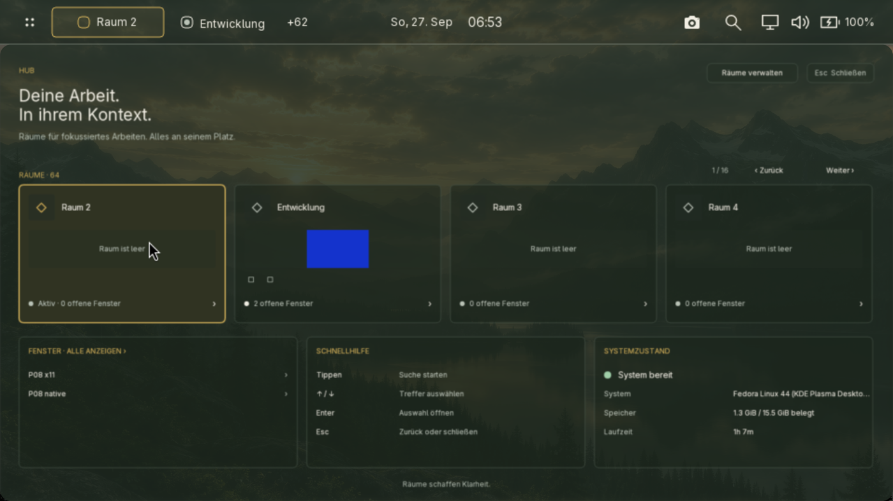
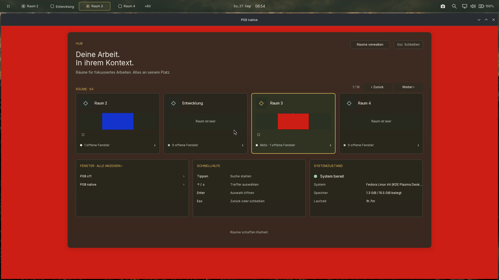
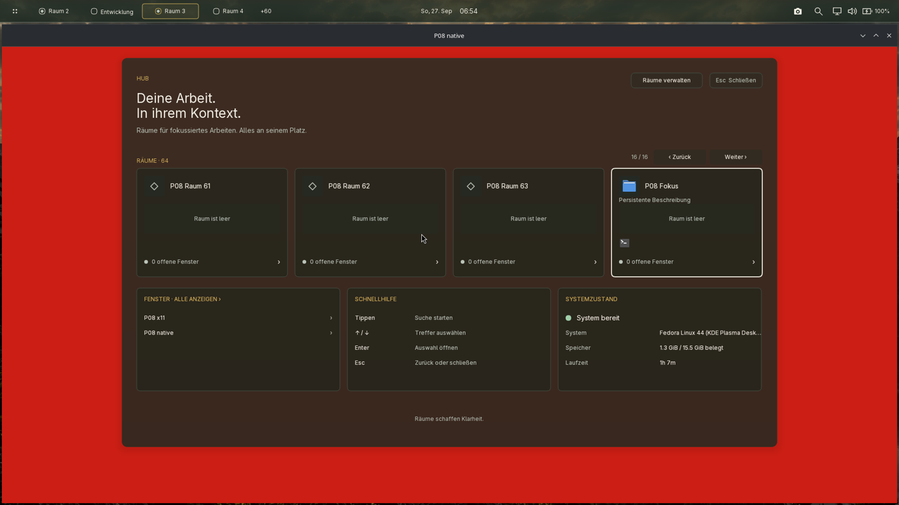
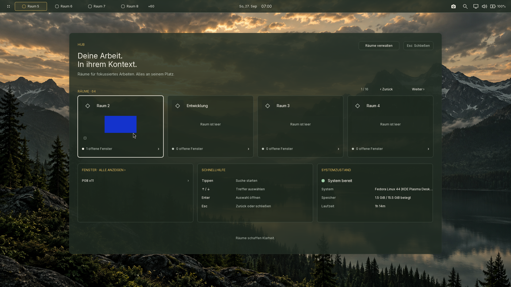
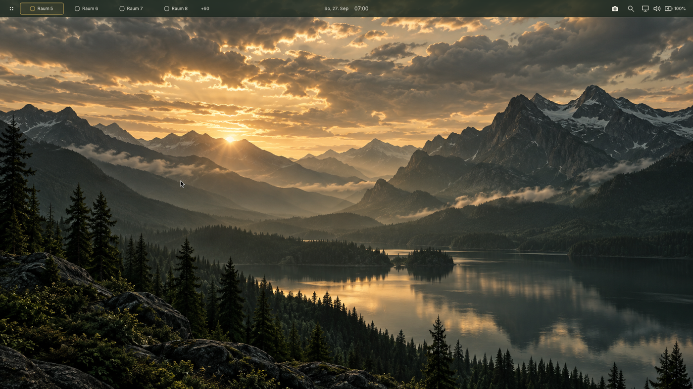
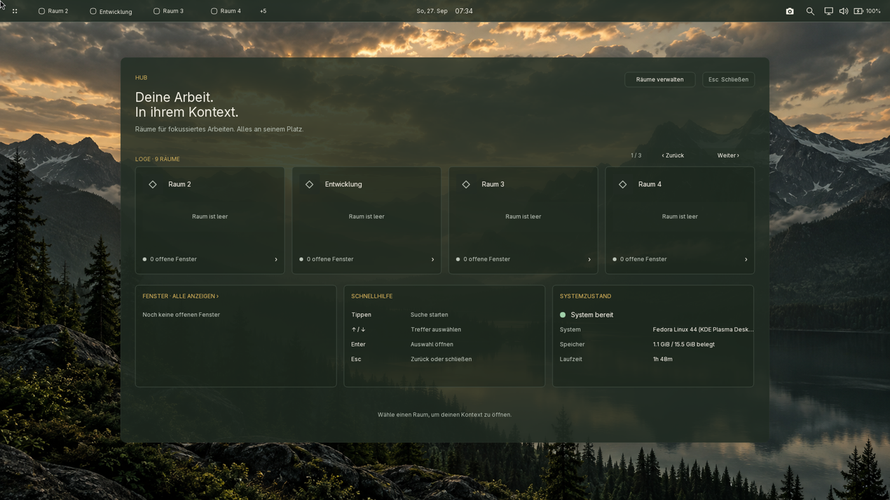

# P08 – Hub-Daten und statische Fenstervorschauen

27.09.2026. **accepted für den dokumentierten Fedora-Funktionsumfang.**
P08-01 bis P08-05 umgesetzt, geprüft und installiert. Grenzen des quantitativen
Performance-Vergleichs sind ausdrücklich unten ausgewiesen. Basis:
`a270e2619a4d5a692d4b55737f7f1d761fe99716`. Keine neuen Dependencies,
keine Cargo.toml-Änderung und keine P09-Funktion. Implementierungscommit:
`6ba7dec` (Quellstand der geprüften und installierten Funktion).

## Verhalten und Call-Flow

Der vollständige Hub verwendet persistente Raum-IDs, Namen, Beschreibungen,
Reihenfolge, Präferenzen und vorhandene Fenster-/Output-Snapshots.
Vier sichtbare Raumkarten pro Seite bleiben erhalten. Pfeile, Tab,
Home/End, PageUp/PageDown, Enter, Escape, Seitenknöpfe und Mausrad führen
durch bis zu 64 Räume. Tippen sucht direkt in Räumen, Fenstern und dem
vorhandenen App-Katalog. Es gibt keinen zweiten Index.

Raumaktion: stabile ID auf den aktuellen Workspace-Slot auflösen, dann
SwitchWorkspace. Fensteraktion: aktuelle Fenster-ID nachschlagen,
Workspace wechseln, FocusWindow senden; minimierte Fenster werden durch
den vorhandenen Compositor-Pfad wiederhergestellt. App-Aktion nutzt den
bestehenden Desktop-App-Startpfad samt Zuordnungspolitik.

Vorschau: sichtbare Raum-ID/Fenster-ID/Output-/Geometriesignatur → einmalige
Capture-Anfrage mit Shell-PID und Hub-Generation → DRM-Capture-Verarbeitung →
isoliertes Toplevel in kleinem GPU-Ziel → private Runtime-Datei →
korrelierte Antwort → validierter Shell-Cache → Raumkarte.
Der alte Capture-Pfad schnitt das zusammengesetzte Outputbild aus und konnte
dadurch den Hub oder verdeckende Fenster abbilden. Der neue Pfad rendert nur
das angeforderte native bzw. X11-Toplevel, auch aus anderen Räumen.

## Lebensdauer und Performance-Modell

- Höchstens vier Hub-Bilder, je maximal 288 × 80 × 4 Byte: insgesamt
  368.640 Byte Bilddaten. Keine Vorschauhistorie.
- Ein Capture je sichtbarer belegter Karte und Generation. Kein Capture-Timer.
  Eine unveränderte Signatur erzeugt keine weitere Anfrage.
- Schließen, Suche/Picker, Theme-/Scale-Wechsel, anderer Output, veränderte
  sichtbare Fenster und Lock verwerfen den Cache. Verspätete Antworten
  früherer Generationen werden verworfen und ihre Dateien entfernt.
- Compositor: maximal 16 wartende Anfragen; Capture-Ziele maximal 512 × 288.
  Private Dateien in XDG_RUNTIME_DIR, exklusiv mit Modus 0600 angelegt,
  höchstens 16 nachgehaltene Dateipfade. Lock leert Queue und Dateien.
- Minimierte/fehlende oder nicht erfassbare Fenster erhalten einen ehrlichen
  Platzhalter. Suche und vollständige Fensterliste bleiben zugänglich.
- Bestehender Icon-Cache und Hintergrund-Lader werden wiederverwendet.
  Größenanpassung auf kleinen logischen Outputs erfolgt nur bei einem
  bestehenden ereignisgesteuerten Repaint, ohne weitere Frame-Timer.
- Render-Reihenfolge unverändert; Glas und Blur bleiben beim Compositor.

## Technisch erforderliche Größenanpassung

Bei 200 % auf 1920×1080 stehen nur 960×540 logische Pixel zur Verfügung.
Die zuvor festen Reihen schnitten die unteren drei Karten ab; das oben
liegende Panel verdeckte außerdem die Hub-Steuerung. Für solche kleinen
Flächen wird die vollständige Komposition aus einer zentral definierten
Mindestfläche von 1366×768 eingepasst. Darstellung und Hit-Testing verwenden
inverse, gemeinsame Koordinaten. Die gemeinsame Launcher-Geometrie hält
den Hub unter dem Panel und gilt auch für das Compositor-Glas. Bei
1920×1080/100 % bleibt der kanonische 1400×832-Hub an Position 260,124
unverändert. Keine Änderung der Layer-Reihenfolge oder Ersatz durch eine Liste. Auch bei transienten extremen
Configure-Seitenverhältnissen ist die Canvas pro Achse auf höchstens die
doppelte kanonische Hub-Größe begrenzt; die getesteten normalen Flächen
erreichen diese Grenze nicht.

## Prüfungen

Alle Pflichtchecks auf Fedora, jeweils Exit 0:

| Befehl | Ergebnis |
| --- | --- |
| cargo check --workspace | grün |
| cargo test --workspace | 1184 bestanden, 0 fehlgeschlagen; ein isolierter D-Bus-Test standardmäßig ignoriert |
| cargo clippy --workspace --all-targets -- -D warnings | grün |
| cargo fmt --all -- --check | grün |
| cargo build --release -p niwoe -p niwoe-shell | grün |
| git diff --check | grün |

Design-Guard, Centralization-Guard und Source-Size-Guard sind im
Workspace-Lauf enthalten und grün. Der separate Lauf

`dbus-run-session -- cargo test -p niwoe-polkit authority_restart_reregisters_and_cancels_pending_auth -- --ignored`

besteht ebenfalls: ein weiterer Test, Exit 0. Damit 1185 bestandene Tests
insgesamt. Python-Testhilfen bestehen `python3 -m py_compile`.

Neue Regressionen decken Generation/Cachegrenzen bei 64 Räumen,
Fensterende/Outputwechsel, ungültige Dimensionen, minimierte Suchziele,
persistente IDs, Suchseiten-/Karten-Hit-Tests, alte IPC-Nachrichten ohne
Request-ID, korrelierte Antworten/Lock, HiDPI-Geometrie und Scrollrichtung ab.

Der Live-Stresstest deckte einen bestehenden IPC-Fehler auf: gültige
Nachrichten mit zusammen mehr als 64 KiB lösten einen Disconnect aus und
verwarfen Steuerereignisse. Ein neuer Test war vor der Korrektur rot.
Der Reader parst jetzt inkrementell und behält eine begrenzte Größe je Nachricht
bzw. unvollständiger Zeile bei; nach 128 Ereignissen gibt er die Ereignisschleife
wieder frei. Der Oversize-Test bleibt grün. Zusätzlich überschreitet ein
gültiger 64-Raum-Snapshot mit maximalen Unicode-Namen/Beschreibungen bereits
64 KiB. Der Empfangsrahmen erhält deshalb 256 KiB, passend zur auf 128 KiB
begrenzten Raumdatei einschließlich JSON-Hülle. Ein eigener Regressionstest
prüft diesen vollständigen Snapshot. Der reale Mausradtest deckte eine
vertauschte Richtung auf; positive Wayland-Achse bedeutet jetzt nächste
Seite, eine rein horizontale Achse verändert die Seite nicht.

## Live-Abnahme

| Fall | Nachweis |
| --- | --- |
| 9 ursprüngliche / 64 temporäre Räume | End/Enter aktiviert Raum 64; Seite 16/16, leere und belegte Karten; Original-IDs und Reihenfolge erhalten |
| Persistente Daten | Beschreibung und App-Referenz im Hub; Umordnung während Auswahl erhält stabile Raum-ID; Raumname über Typen gefiltert |
| Konkretes Fenster | Klick auf blaue X11-Vorschau aktiviert Raum 2; Suche nach nativem Fenster aktiviert Raum 3 |
| Minimiertes Fenster | Native App minimiert, per Hub-Suche wiederhergestellt; Snapshot bestätigt minimized=false |
| App-Katalog / Loge | Neuer Login startet bei active_workspace=0 ohne Fenster; Konsole via Hub gestartet, Ziel Raum 1; Test-App danach geschlossen |
| Isolierte Bilder | Native rote und X11-blaue Oberflächen über rohe Pixel geprüft, auch in anderen Räumen; jeweils >40 % erwartete Farbe, korrekte Maße/Dateigröße |
| Zwei Outputs | 1920×1080/60 Hz und 3840×2160/30 Hz; Zeigerwechsel bei offenem Hub, focused_output_id wechselt korrekt |
| 150 / 200 % | Live-Scale-Snapshot, Raumklick, beide Thumbnail-Pixeltests und primäres Bildschirmfoto; Konfiguration bytegenau zurückgesetzt |
| Großer gültiger Snapshot | 67.114 Byte mit maximalen Unicode-Metadaten eigener Räume live empfangen; Seite 16 sichtbar und anschließend active_workspace=64 bestätigt. Erste Eingabeversuche während des wechselnden Outputzustands bestätigten die Aktivierung nicht und wurden nicht als bestanden gewertet. |
| Mausrad | Echter REL_WHEEL-Eingabepfad; Scrollen nach unten aktiviert anschließend den ersten Raum auf Seite 2 |
| Fensterende | Native App bei offenem Hub geschlossen; rote Vorschau verschwindet, Raum wird leer, Fensterzeile entfernt |
| Lock | SessionLocked empfangen; Runtime-Thumbnails entfernt; Capture auf existierende Fenster-ID während Lock liefert kein Bild; Passwort-Entsperren und geschlossener Hub optisch geprüft |
| Wiederholtes Öffnen | 3 × 20 reale Super+Space/Escape-Zyklen; höchstens vier Antworten je Öffnung, keine Duplikate, geschlossen keine Captures |
| Bereinigung | Nur eigene Testfenster und 55 eigene Räume entfernt; ursprüngliche neun Raumdefinitionen exakt verglichen; letzter Neulogin wieder neutral |

Zusätzlicher [Unicode-Grenzfall mit 67.114 Byte](P08-evidence/unicode-last-page.png).

Einige Screenshotversuche liefen beim Consent bzw. unmittelbar nach
Watchdog-Start in einen Timeout; sie zählen nicht als Nachweis. Der bestehende
Screenshot-Bridge-Pfad kann zudem den sekundären Output auswählen. Der
1920-Pixel-Filter der Testhilfe ist nur ein Vorfilter. Nach einer Neuverhandlung
hatten beide Outputs diese Breite; dann entscheidet die Sichtprüfung anhand
von Panel/Hub. Die oben verlinkten Bilder wurden einzeln visuell geprüft.

Rohbelege: Fedora `/home/eduard/niwoe-desktop/target/p08-*` und `target/p08-live/`.

## Performance-Ergebnis

Fedora-Testrechner mit i915 und zwei physischen Outputs, 100 % Skalierung.
Die frühen Funktions-/Ausgangsprüfungen hatten 1920×1080/60 Hz und
3840×2160/30 Hz. Nach Neulogins/erneuter DRM-Erkennung meldete der zweite
Connector keine bevorzugte Auflösung mehr und nur noch Modi bis 1920×1080;
der DRM-Fallback verwendete 1920×1080/60 Hz. Der gespeicherte Nachher-
Snapshot bestätigt daher **zweimal 1920×1080/60 Hz**. Ein temporärer Versuch,
3840×2160/30 Hz wieder anzufordern, wurde als nicht verfügbar abgelehnt;
die Konfiguration wurde bytegenau wiederhergestellt. Es wurde kein
nicht angebotener Modus erzwungen.
Je drei aufeinanderfolgende 300-Sekunden-Proben; nach dem letzten Neulogin
30 Sekunden Warm-up, neun ursprüngliche Räume und keine App-Fenster.
Nachher blieb der Willkommens-Hub offen. Die genaue Hub-Offenheit der
ruhenden Ausgangssitzung wurde nicht separat gesichert; die Werte sind
deshalb kein isolierter Kostenvergleich eines einzelnen Renderpfades.

CPU aus /proc/PID/stat, Prozent eines Kerns; RSS in MiB. GPU aus i915
/proc/PID/fdinfo, Engine-Nanosekunden über Laufzeit, gleiche DRM-Client-ID
nur einmal gezählt.

| Messung | Compositor CPU vorher → nachher | Shell CPU vorher → nachher | GPU-Engine nachher |
| --- | --- | --- | --- |
| 1 | 0,780 → 1,070 % | 0,140 → 0,197 % | 0,01245 % |
| 2 | 0,717 → 1,080 % | 0,127 → 0,197 % | 0,01243 % |
| 3 | 0,630 → 1,077 % | 0,123 → 0,187 % | 0,01242 % |

Median-Anstieg: Compositor +0,360, Shell +0,070 Prozentpunkte.
Auch jeder beobachtete Vorher-/Nachher-Unterschied liegt unter +0,5
Prozentpunkten. Wegen der unterschiedlichen Monitor-Modi ist dies jedoch
**kein strenger Nachweis des relativen CPU-Budgets bei identischem Aufbau**. Keine pauschale Behauptung einer GPU-Regression:
GPU-Ausgangswerte wurden nicht erfasst. Engine-Zeit umfasst nicht sämtliche
Display-/Scanout-Kosten.

Compositor-RSS nachher durchgehend 131,04 MiB; Shell 60,94 → 61,07 MiB
in der ersten Probe, danach unverändert. Vorher: Compositor 94,74–96,36 MiB,
Shell 48,79–50,48 MiB. Die absoluten Werte stammen aus verschiedenen
Sitzungen mit nicht unabhängig belegtem gleichem Hub-Offenheitszustand;
sie belegen hier stationären Speicher, keine exakte Zuordnung der Differenz.

Drei Serien zu 20 Öffnen/Schließen-Zyklen mit zwei belegten Räumen und
64 Räumen insgesamt: genau zwei Captures je Öffnung, nie doppelte Request-IDs,
keine Captures während der geschlossenen Intervalle und der abschließenden
fünf Sekunden. Shell-RSS je Serie 92,22–92,59 / 92,59 / 92,59–92,72 MiB;
kein Wachstum mit jedem Öffnen. Der Unit-Test sichert zusätzlich die harte
Obergrenze von vier Bild-/Request-Einträgen und das vollständige Leeren.

Die gemessene Eingabe-bis-Capture-Empfangszeit hatte Mediane von
351,34 / 351,26 / 351,40 ms. Das Eingabeskript wartet selbst 350 ms während
der Tastenkombination, bevor es Antworten liest. **Das ist kein belastbarer
Eingabe-bis-sichtbar-Wert.** Eine optische bzw. präsentationsbasierte
Latenzbaseline und belastbare Repaint-Zähler fehlen; das 10-%-Latenzbudget
ist damit nicht quantitativ nachgewiesen. Dieser Punkt bleibt eine
Messgrenze der dokumentierten Fedora-Abnahme.

Die Messung erfolgte mit Compositor 44a700f… und Shell 4f6cae9… vor den
anschließenden Schutzgrenzen für transiente Canvas-Größen und große
IPC-Snapshots. Beide Änderungen greifen bei den gemessenen normalen
Geometrien/kleinen Snapshots nicht. Sie werden separat mit der vollen
Testsuite und Release-Aktivierung geprüft; keine unzutreffende Zuordnung
dieser 15-Minuten-Messung zu späteren Binary-Hashes.

Rohdaten: [vorher](P08-evidence/idle-before.json),
[nachher](P08-evidence/idle-after.json),
[60 Zyklen](P08-evidence/open-close-cycles.json),
[Nachher-Messkontext](P08-evidence/idle-context.json).
Wiederholung: nach Warm-up
`python3 scripts/measure-hub-performance.py target/idle.json`;
währenddessen keine GUI-Eingaben oder Builds.

## Installation

Builds werden mit installierten Dateien und laufenden `/proc/PID/exe`-Hashes
verglichen. Compositoränderungen wurden per autorisiertem Neulogin aktiviert,
reine Shell-Zwischenstände über den vorhandenen Watchdog.
Die temporäre Einmal-Autologin-Konfiguration wurde jeweils sofort entfernt.
Aktive Endidentität:
- Compositor: 8f2b37b1d7ec0654d5cfd6a4482809b444902b61749f1ecb9cbed2c0944166ce
- Shell: 2bdb754e625998df3eb7f266ff5478d9d12171a7017293cb24c62b863973aa30

Letzter Neulogin bestätigt neun ursprüngliche Räume in Reihenfolge
2,1,3,4,5,6,7,8,9, active_workspace=0 und keine Testfenster.
Die geprüften KDE-/GTK-Konfigurationshashes vor/nach Installation sind
identisch; NIWOE config.toml ist bytegenau wiederhergestellt. Raumdefinitionen
und Reihenfolge sind unverändert; Revisions-/ID-Zähler wurden durch die
regulären Testmutationen fortgeschrieben.

Letzter aktiver Nachweis: Compositor PID 66312 und Shell PID 66325 mit den
obigen Hashes. Keine Aktivierung und kein weiterer Neulogin ausstehend.

Bereinigung abgeschlossen: nur eigene Testfenster und Test-Raum-IDs entfernt,
ursprüngliche uinput-ACL wiederhergestellt, Einmal-Autologin-Datei entfernt,
exakt der temporäre P08-Schlüssel aus authorized_keys entfernt und seine
lokalen privaten Kopien gelöscht. Kein Passwort in den erzeugten Skripten.

## Änderungen je Datei

| Datei | Änderung |
| --- | --- |
| `crates/niwoe-tokens/src/hub.rs` | Zentrale Vorschau-/Such-/Iconmaße, Mindestfläche und gemeinsame Launcher-Einpassung samt Tests. |
| `crates/niwoe-tokens/src/chrome.rs` | Gemeinsame fitted_rect-Implementierung nach hub.rs verschoben; Datei bleibt unter 600 Zeilen. |
| `crates/niwoe-tokens/tests/launcher_geometry.rs` | Panel-Freihaltung und unveränderte kanonische Hub-Geometrie geprüft. |
| `crates/niwoe-ipc/src/lib.rs` | Optionale Capture-Request-ID und SessionLocked-Ereignis; kein stiller Bruch alter Capture-Nachrichten. |
| `crates/niwoe-ipc/src/lib_tests.rs` | Bestehende Konstruktoren um die optionale ID ergänzt. |
| `crates/niwoe-ipc/src/thumbnail_tests.rs` | Alte Nachricht, Korrelation und Lock-Serialisierung geprüft. |
| `crates/niwoe-compositor/src/state/mod.rs` | Korrelationsfeld und begrenzte Runtime-Dateinachhaltung. |
| `crates/niwoe-compositor/src/state/setup/dirty_and_construction.rs` | Leere Dateinachhaltung initialisiert. |
| `crates/niwoe-compositor/src/state/ipc/commands.rs` | Capture-Queue/Abmessungen begrenzt, Lock ablehnen; Lock-Status bei Snapshot-Reconnect übertragen. |
| `crates/niwoe-compositor/src/state/handlers/session_lock.rs` | Queue/Dateien bei Lock verwerfen und Shell informieren. |
| `crates/niwoe-compositor/src/backend/drm/render/capture.rs` | Alten Output-Ausschnitt/Downsampler entfernt, isoliertes Capture-Modul eingebunden. |
| `crates/niwoe-compositor/src/backend/drm/render/thumbnails.rs` | Toplevel-Offscreen-Capture, private Dateien, begrenzte Nachhaltung und korrelierte Antwort. |
| `crates/niwoe-shell/src/main.rs` | HubState-Modul eingebunden. |
| `crates/niwoe-shell/src/hub_state.rs` | Vier-Karten-Cache, Generationen, vorhandene Daten durchsuchen, stabile App-Identität, Achsenrichtung. |
| `crates/niwoe-shell/src/hub_state/tests.rs` | Cache, späte Antworten, Fensterende, Dimensionen, stabile Suchziele und Scrollrichtung geprüft. |
| `crates/niwoe-shell/src/hub_view.rs` | Seitenausschnitt und echte Hub-Daten zeichnen; vorhandene Tests in Untermodul verschoben. |
| `crates/niwoe-shell/src/hub_view/tests.rs` | Bestehende Geometrie-/Renderprüfungen erhalten. |
| `crates/niwoe-shell/src/hub_view/rooms.rs` | Echte Beschreibung, Vorschau, Präferenz-Icon und App-Icons integriert. |
| `crates/niwoe-shell/src/hub_view/previews.rs` | Cachebilder/Platzhalter, Icon-Auflösung und Seitennavigation. |
| `crates/niwoe-shell/src/hub_view/search.rs` | Gemeinsame Hub-Suchfläche und konsistente paginierte Treffer-Hit-Tests. |
| `crates/niwoe-shell/src/hub_view/hit.rs` | Echte Fensterzeilen getrennt vom vollständigen Fensterlisten-Zugang treffen. |
| `crates/niwoe-shell/src/hub_view/interaction_tests.rs` | Letzte Suchseite sowie gemeinsame Karten-/Vorschaugeometrie geprüft. |
| `crates/niwoe-shell/src/wayland/mod.rs` | Hub-Controller eingebunden. |
| `crates/niwoe-shell/src/wayland/shell.rs` | HubState als Shell-Zustand. |
| `crates/niwoe-shell/src/wayland/init/shell_state.rs` | HubState initialisiert. |
| `crates/niwoe-shell/src/wayland/hub.rs` | Navigation, stabile Zielauflösung, Capture-Vorbereitung, validierter Empfang und Lock-Schließung. |
| `crates/niwoe-shell/src/wayland/handlers/keyboard.rs` | Hub-Tastatur vor dem alten Launcher-Pfad verarbeitet. |
| `crates/niwoe-shell/src/wayland/handlers/pointer/launcher.rs` | Gemeinsame inverse Einpassung und Hub-Pointer-Verarbeitung. |
| `crates/niwoe-shell/src/wayland/handlers/compositor.rs` | Vorschau bei Scale-Wechsel invalidiert. |
| `crates/niwoe-shell/src/wayland/handlers/layer.rs` | Hub-Cache beim Layer-Ende verworfen. |
| `crates/niwoe-shell/src/wayland/handlers/pointer/panel_and_popups.rs` | Legacy-Capture mit request_id=None kompatibel gehalten. |
| `crates/niwoe-shell/src/wayland/state/shell_actions.rs` | Weiteren Legacy-Capture-Aufrufer aktualisiert. |
| `crates/niwoe-shell/src/wayland/state/ipc_events.rs` | Echte Daten/Icons aktualisieren, Auswahl per ID bewahren, Preview-/Lock-Ereignisse delegieren und Theme invalidieren. |
| `crates/niwoe-shell/src/wayland/state/popups.rs` | Generation, Seite und Auswahl bei Hub-Toggle zurücksetzen. |
| `crates/niwoe-shell/src/wayland/render/launcher.rs` | Hub-Captures vorbereiten, Daten/Suche zeichnen, kleine Flächen einpassen und Cache beim Unmap leeren. |
| `crates/niwoe-shell/src/wayland/window_picker.rs` | Konkrete Hub-Fensterzeile aktiviert das Fenster; Kopf/Leerfläche öffnen vollständige Liste. |
| `crates/niwoe-shell/src/wayland/ipc.rs` | Gültige Nachrichtenbursts inkrementell parsen; reproduzierender Regressionstest. |
| `scripts/test-hub-data.py` | Wiederholbare Fedora-Prüfhilfe für eigene native/X11-Fenster, Räume, Capture-Pixel, Eingaben und gezielte Bereinigung. |
| `scripts/measure-hub-performance.py` | Wiederholbare CPU-/RSS-/DRM-Engine-Messung, drei fünfminütige Samples ohne GUI-Eingriff. |
| `NIWOE_IMPLEMENTATION_PLAN.md` | P08-Abschluss und nächste Phase P09 dokumentieren. |
| `docs/phase-reports/P08.md`, `P08-evidence/*` | Dateimatrix, Prüfungen, Runtime-/Bildbelege, Performance und Grenzen. |

## Diff-Review

Ergebnis: **accepted für den oben geprüften Funktionsumfang**. Render-/Input-/
IPC-Call-Flow manuell verfolgt; keine Änderung der Render-Reihenfolge, keine
neue Dependency und keine Rust-Datei über 600 Zeilen. Entdeckte Findings
(Output-Ausschnitt statt Toplevel, IPC-Burstverlust, große gültige Snapshots,
HiDPI-Clipping/Panelüberdeckung, Scrollrichtung und transiente Allokation)
im selben Block behoben und nachgeprüft. Keine offenen funktionalen
P08-Findings im getesteten Fedora-Aufbau. Die folgenden Messgrenzen bleiben
als solche offen und werden nicht als erfüllte quantitative Gates ausgegeben.

## Grenzen

Statische Einzelvorschau, keine Live-Videos oder Vorschau jedes Fensters.
Pixeltests verwenden kontrollierte rote/blaue native/X11-Fenster.
Andere GPU-/Treiberkombinationen und eine optische Frame-Latenzmessung sind
durch diesen Fedora-Lauf nicht abgedeckt. Der relative CPU-Vergleich ist
wegen geänderter Monitor-Modi eingeschränkt; die absoluten Idle-Werte und
die Cache-/Lebensdauerprüfungen sind dokumentiert. Keine Aussage, dass
unbekannte Latenz- oder GPU-Ausgangswerte null seien.
